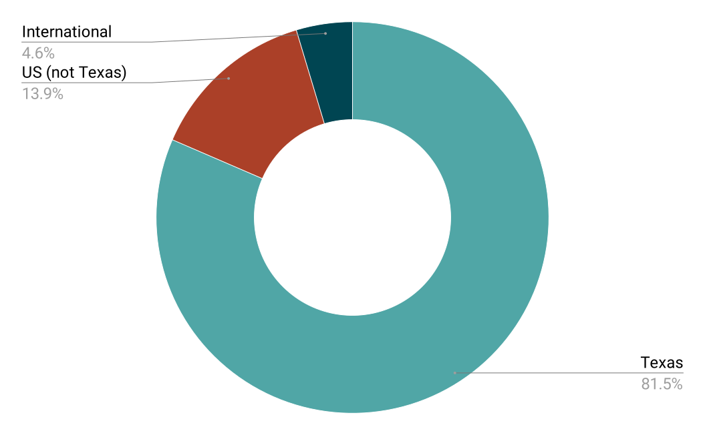
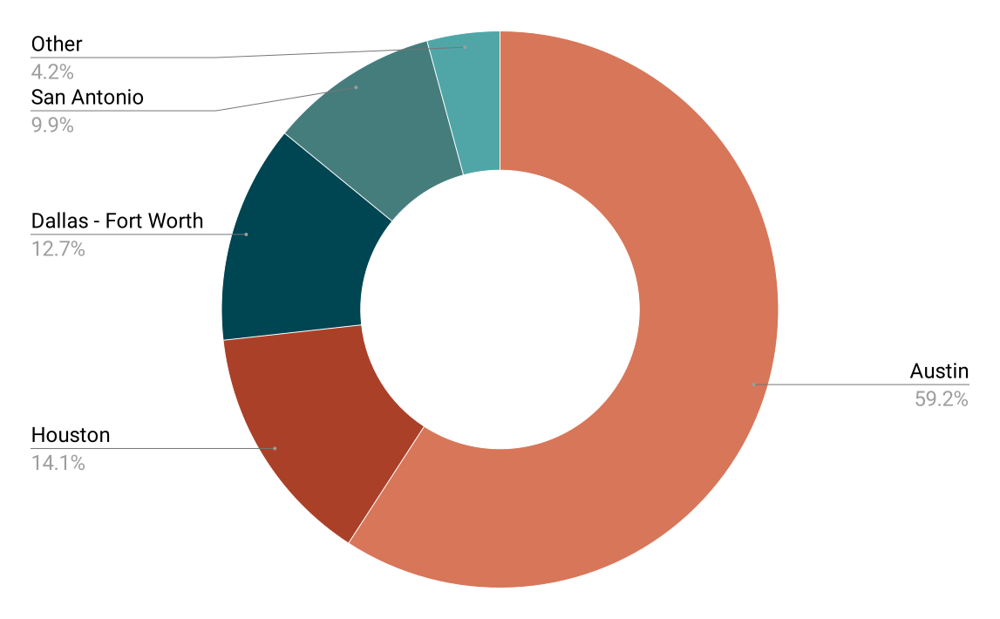
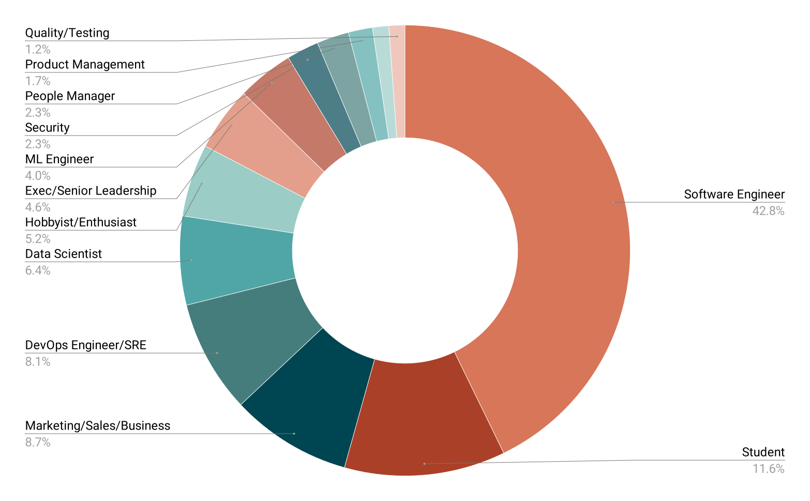
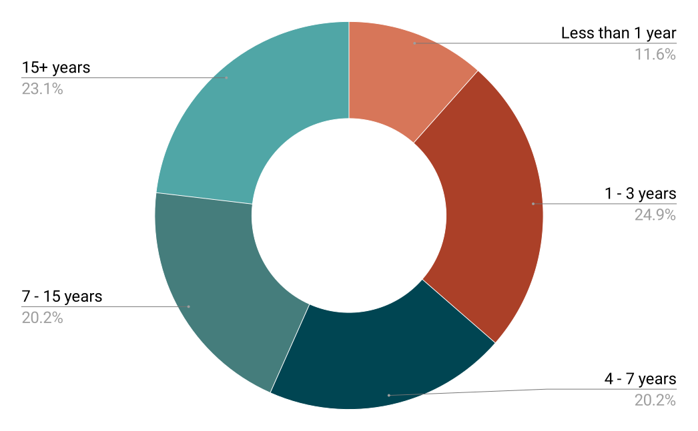

# Sponsor Us

This year is the **20th year** of the annual PyTexas Conference, a gathering of Pythonistas put on by the PyTexas Foundation, a 501(c)3 non-profit organization. 

We’re excited to announce that we will be returning on April 17&ndash;19, 2026, to the Austin Central Public Library in Austin, TX. 
This event is 100% community organized and is funded through the generosity of our sponsors.

## Prospectus Launching End of April 2025!

*Get notified about the latest opportunities to sponsor PyTexas.*

[Join the PyTexas Sponsors Mailing List](https://mailchi.mp/fc46f2d077fe/pytexas-sponsors){ .md-button .pytx-button--primary }

<!-- 
///If your enterprising self found this, it is not ready. This is last years. Shoo./// 
## 2026 Prospectus

| | Platinum | Gold | Silver | Bronze | Lanyard | Live Captioning | Food/Coffee | Networking Event | 
| -- | :--: |  :--: |  :--: |  :--: |  :--: |  :--: |  :--: | :--: |
| Number remaining | 2 | 4 | 4 | 15 | 2 | 2 | 2 | 6 |
| Cost (USD) | 9000 | 5000 | 3000 | 1000 | 2000 | 2000 | 4000 | 4000 |
| Tickets included | 4 | 2 | 1 | 1 | 2 | 2 | 2 | 2 |
| Pitch | 2 min | 2 min | 1 min | 1 min | 2 min | 2 min | 2 min | 2 min |
| Table | :fontawesome-solid-check: | :fontawesome-solid-check: | :fontawesome-solid-check: | | | | | :fontawesome-solid-check: [^1] |
| Sponsored talk Slot before lunch, 20 minutes | :fontawesome-solid-check: [^2] ||||||||
| Logo on lanyard | |||| :fontawesome-solid-check: ||
| Logo on PyTexas videos and live stream | ||||| :fontawesome-solid-check: ||
| Logo at breakfast, lunch, snacks, and beverages | |||||| :fontawesome-solid-check: ||
| Logo on website | :fontawesome-solid-check: | :fontawesome-solid-check: | :fontawesome-solid-check: | :fontawesome-solid-check: | :fontawesome-solid-check: | :fontawesome-solid-check: | :fontawesome-solid-check: | :fontawesome-solid-check: | :fontawesome-solid-check: |
| Logo on opening and closing slides | :fontawesome-solid-check: | :fontawesome-solid-check: | :fontawesome-solid-check: | :fontawesome-solid-check: | :fontawesome-solid-check: | :fontawesome-solid-check: | :fontawesome-solid-check: | :fontawesome-solid-check: | :fontawesome-solid-check: |
| Social media callout | :fontawesome-solid-check: | :fontawesome-solid-check: | :fontawesome-solid-check: | :fontawesome-solid-check: | :fontawesome-solid-check: | :fontawesome-solid-check: | :fontawesome-solid-check: | :fontawesome-solid-check: | :fontawesome-solid-check: |
| Shared swag table for stickers and other swag UNSTAFFED | :fontawesome-solid-check: | :fontawesome-solid-check: | :fontawesome-solid-check: | :fontawesome-solid-check: | :fontawesome-solid-check: | :fontawesome-solid-check: | :fontawesome-solid-check: | :fontawesome-solid-check: | :fontawesome-solid-check: |

///Footnotes Go Here/// 

[^1]: At network event
[^2]: Date selection is first come, first serve. Talk is subject to approval. All talks go through the talk review process to ensure that PyTexas remains a high quality conference. Sponsored talks should be the same kind of talks that you would submit through our normal call for proposals. Sales pitches, advertisements, and talks that are not relevant to the Python community will be rejected. **Note that we reserve the right to reject a talk if we think it could jeopardize our 501(c)3 status.**

### Lead Gathering

The PyTexas Conference does not currently offer lead scanning as part of our sponsorship packages.
However, we have had many sponsors successfully gather leads through other means throughout the conference.

We've seen the following lead scanning techniques uses to great success by our sponsors in the past:

1. Perform a raffle for a big ticket item at the end of the conference and have attendees fill out a form to enter
    1. Some items we've seen have been AirPods Max, Beats, small tablets, large Lego sets
1. Require filling out a web form (Google, SurveyMonkey, etc) to receive a larger or more expensive piece of swag
1. Have links to their company's communities/newsletters as scannable QR codes for attendees to scan

If you choose to do a raffle, we will provide you time (1 - 2 min) on the main stage to perform your raffle and take photos.

## About the PyTexas Conference

The PyTexas Conference is a regional Python-focused conference held annually in the spring every year since 2007 (with a few exceptions). It is the oldest regional Python conference in North America, and possibly the world. Typically, we draw famous Python speakers as well as regional and local Python experts to teach attendees about Python and related technologies.

**On average, we sell out our venue and have 200-250 attendees a year.**

### 2025 Demographics

We had guests from all over the world, though our audience primarily is in Texas.

{.pytx-prospectus-graph}
{.pytx-prospectus-graph}

We primarily get software engineers and other engineering fields, though we had some leadership and management folks attend.

{.pytx-prospectus-graph-lg}

 Also, we have a fairly even spread of experience.

{.pytx-prospectus-graph-lg}

## How We Use The Funds

All sponsorship funds are used for the benefit of the PyTexas Conference and Foundation and the Texas Python community. We utilize funds to pay our venue, vendors, supplies, and all other things conference related. Any surplus funds that we collect are used to fund the minimal operating cost of the Foundation for the remainder of the year (primarily costs around bookkeeping, email, and foundation governance), as well as make next year’s PyTexas better.

Also, in an attempt to make PyTexas as accessible as possible to everyone, we subsidize our Individual ticket prices with Corporate tickets and Sponsorship funds. By doing this we are able to keep PyTexas Individual tickets as low as possible, ensuring that everyone can attend. If an attendee can’t afford a ticket, they can apply for a grant where we can offer them free tickets and sometimes funds for travel expenses.

---

Thank you for considering to sponsor PyTexas.

If you’re interested in sponsoring PyTexas, please reach out to [sponsorship@pytexas.org](mailto:sponsorship@pytexas.org).
-->